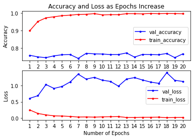
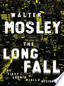
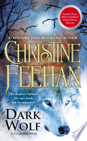
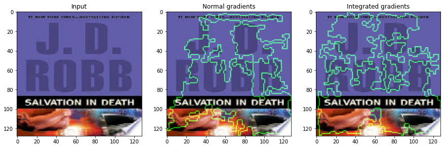
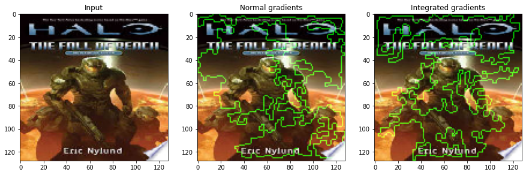
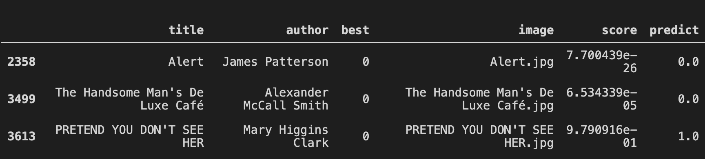
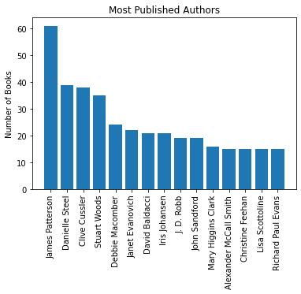

# How to Judge a Book by it's Cover

[Amazing Youtube Project Overview!](https://youtu.be/tJtXw1NoL1I)

[Amazing Slideshow!](https://docs.google.com/presentation/d/1dBOCxwwQhlkWENBlZSQ7UV_Y1bZGVbXeL5g2gCk_074/edit?usp=sharing)

As everyone knows it's impossible for a human to judge a book by its cover properly but when it comes to neural networks, they miraculously find a way. My hypothesis a neural network would be able to predict if a book cover was an NYT bestseller (2008-2018) with prediction accuracy over 0.5. 
The TensorFlow CNN I used had the following specifications:
 * Adam optimizer
 * Relu Activation Function
 * 3X3 Kernel Size
 * Categorical_crossentropy
 * Softmax activation function
 
>

This graph shows that my epoch should be low (4 to 6) because validation loss increases as validation accuracy remains around the same.
Using overall accuracy as my metric 0.76 was the score of my model using 5 epochs. 

## Intresting Findings
>

	My model predicted these two images as non-best sellers with the highest certainty.
	The second IS a best seller.

>

     My model predicts these book covers as best sellers with the most certainty (when they are not).

>

    These two books had my model stumped with the lowest certainty each (~0.5 score).
    They are both best sellers.

>
>

    These residual plots show the feature detection of the model.
    First is the highest certainty best seller and the second is 
    the highest certainty non-best seller. 

>
>

    If I were to be magically unblocked from querying google's API, I would attempt to 
    understand if my model learns to overfit based on the best seller's cover styles. 

I hope to deploy this interactive upload to my website [lynxrose.com](lynxrose.com) soon.

# Sources
[Kaggle NYT Best Sellers](https://www.kaggle.com/cmenca/new-york-times-hardcover-fiction-best-sellers) by [Carlo](https://www.kaggle.com/cmenca)

Data scraped from [Google Books API](https://developers.google.com/books/docs/overview)

Tools: Python, Matplotlib, Numpy, Pandas, and TensorFlow

GitHub Project by Lynx Rose
